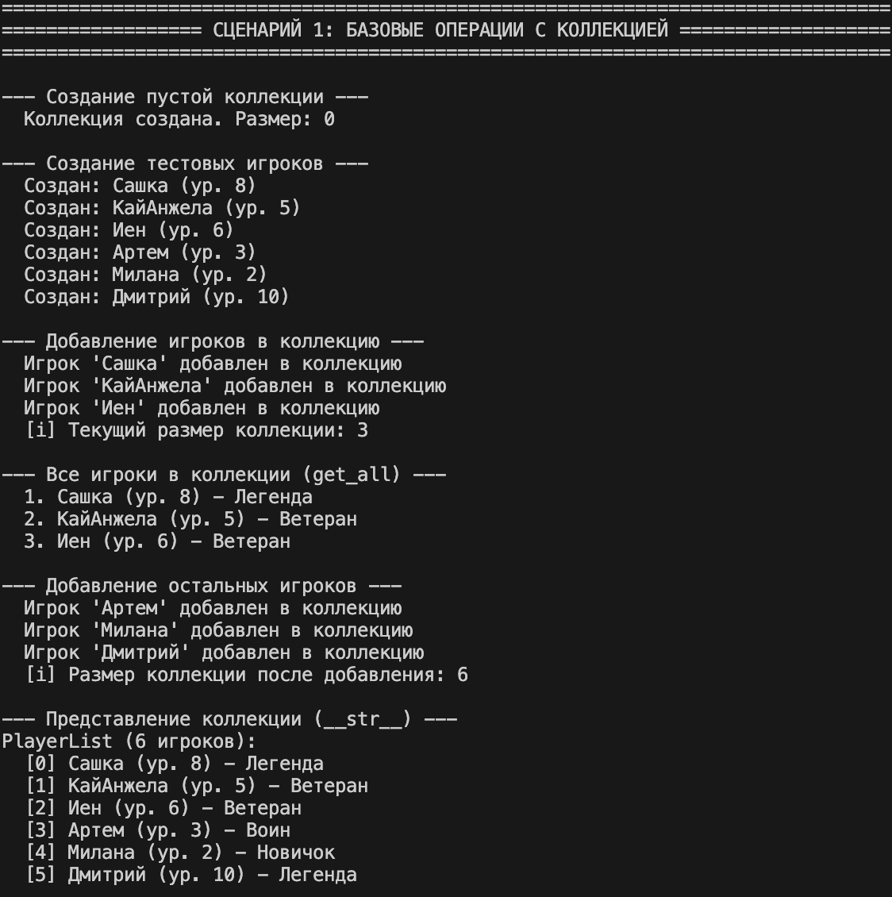
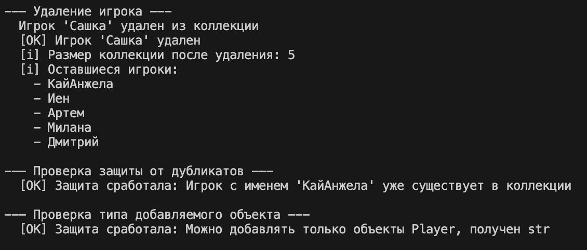
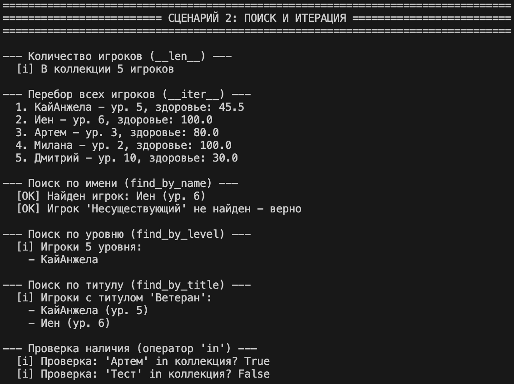
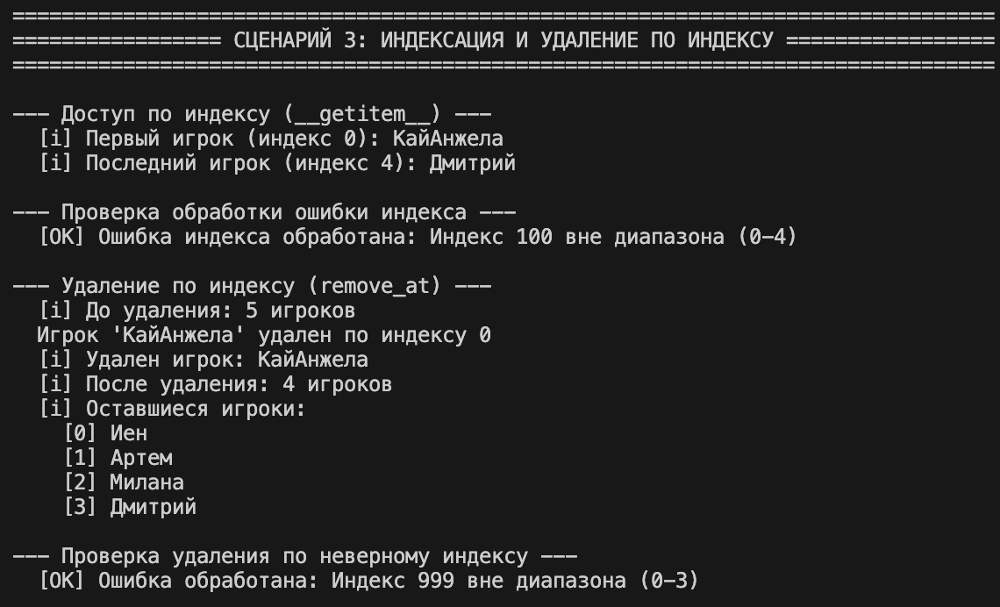
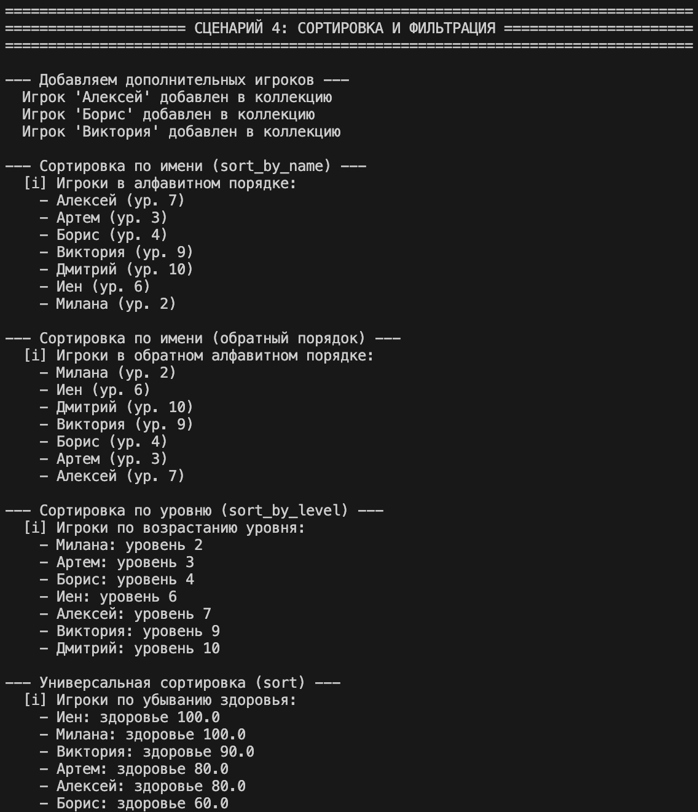
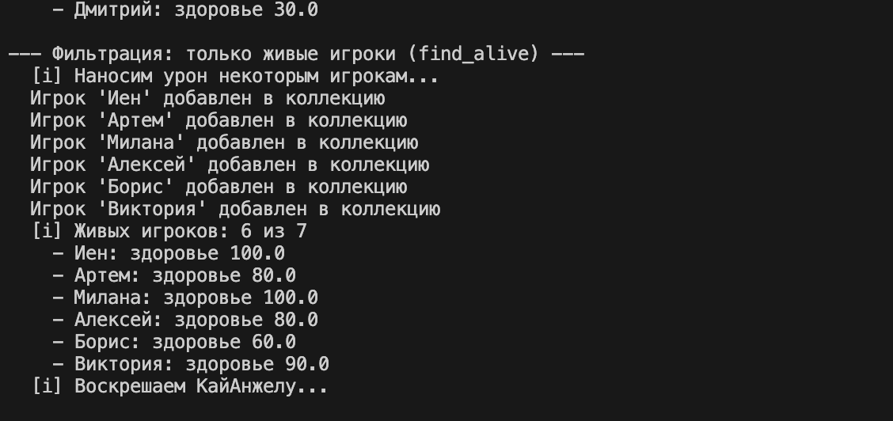
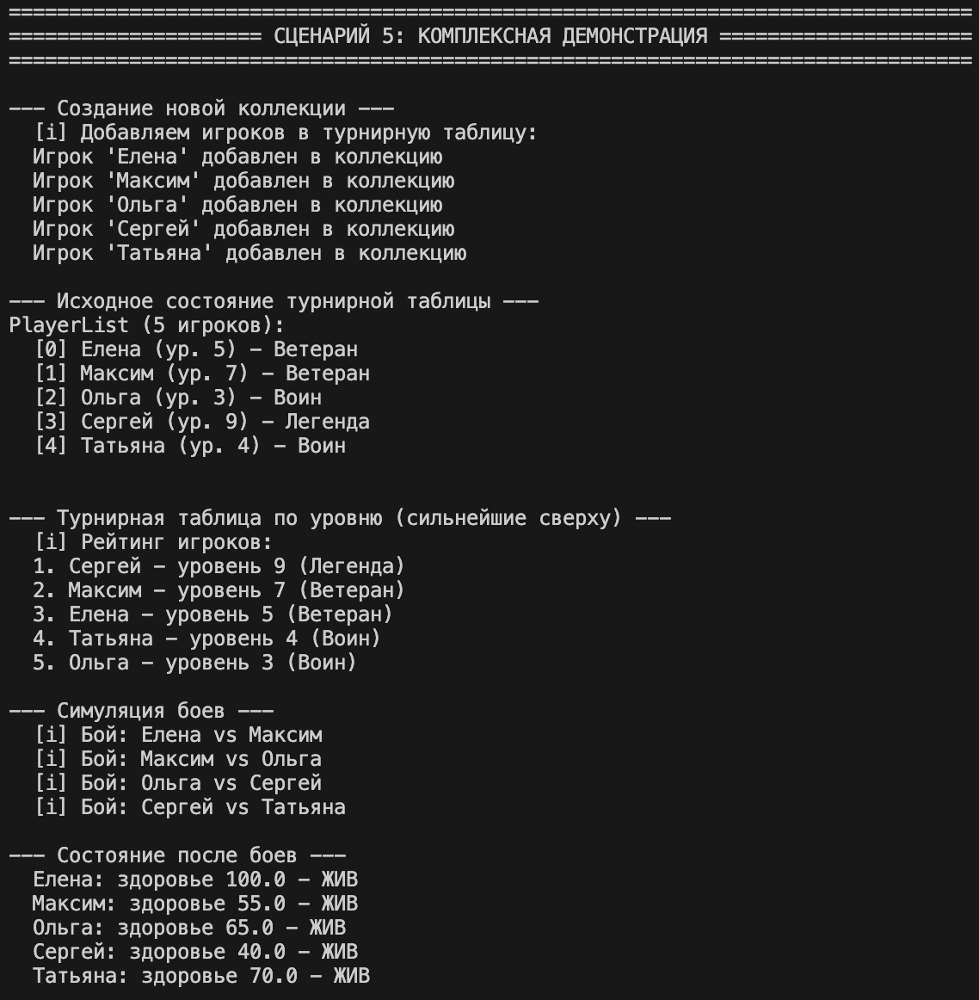
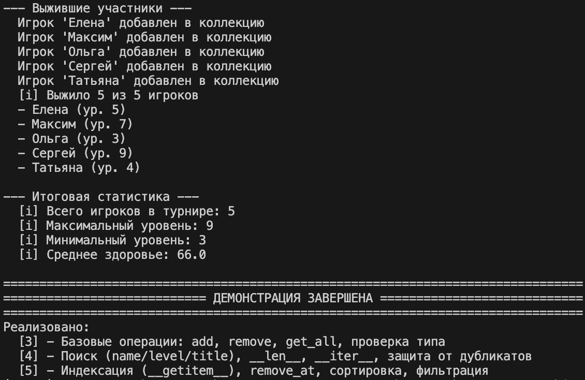

# ЛР-2 — Коллекция объектов

## Цель работы

Научиться работать с коллекциями объектов, понять разницу между моделью сущности и контейнером объектов, реализовать собственный контейнерный класс с итерацией и базовыми операциями управления.

---

## Предметная область

**Игровая логика / RPG**

Выбранная сущность: **`Player`** (Игрок) → контейнер: **`PlayerList`**

---

## Описание класса

Реализован контейнерный класс `PlayerList`, который хранит объекты `Player` из первой лабораторной работы и управляет ими.

---

## Реализованные возможности

### Базовые операции (оценка 3)
- `add(player)` — добавить игрока с проверкой типа и дубликатов;
- `remove(player)` — удалить игрока;
- `remove_at(index)` — удалить игрока по индексу;
- `get_all()` — получить список всех игроков.

### Поиск и итерация (оценка 4)
- `find_by_name(name)` — поиск по имени (без учёта регистра);
- `find_by_level(level)` — поиск по уровню;
- `find_by_title(title)` — поиск по титулу;
- `__len__()` — поддержка `len(player_list)`;
- `__iter__()` — поддержка `for player in player_list`;
- `__contains__()` — поддержка `player in player_list`.

### Расширенные операции (оценка 5)
- `__getitem__(index)` — индексация `player_list[0]`;
- `sort_by_name(reverse)` — сортировка по имени;
- `sort_by_level(reverse)` — сортировка по уровню;
- `sort(key, reverse)` — универсальная сортировка по любому атрибуту;
- `find_alive()` — получить только живых игроков.

---

## Защита коллекции

- нельзя добавить объект не являющийся `Player`;
- нельзя добавить дубликат (сравнение по имени, регистронезависимо).


## Демонстрация работы

### В файле demo.py показаны 5 сценариев использования коллекции:
### Сценарий 1: Базовые операции

- создание пустой коллекции;

- добавление игроков;

- проверка защиты от дубликатов;

- проверка типа добавляемого объекта;

- удаление игроков.

### Сценарий 2: Поиск и итерация

- получение количества игроков через len();

- перебор всех игроков через for;

- поиск по имени, уровню и титулу;

- проверка наличия через in.

### Сценарий 3: Индексация и удаление по индексу

- доступ к игрокам через collection[0];

- обработка ошибки при неверном индексе;

-  удаление игрока по индексу.

### Сценарий 4: Сортировка и фильтрация

- сортировка по имени (прямой и обратный порядок);

- сортировка по уровню;

- универсальная сортировка по здоровью;

- получение живых игроков через фильтрацию.

### Сценарий 5: Комплексная демонстрация

- создание турнирной таблицы;

- сортировка для определения мест;

- симуляция боёв;

- получение выживших участников;

- подсчёт статистики.

## Структура проекта

```text
python_oop/
├─ README.md
├─ src/  
│  ├─ lab01/
│  │   ├─ model.py
│  │   ├─ validate.py
│  ├─ lab02/
│  │   ├─ collection.py
│  │   └─ demo.py
└─ images/
   └─ lab02/
```

## Терминал(Вывод)

### Сценарий 1: Базовые операции с коллекцией





### Сценарий 2: Поиск и итерация


### Сценарий 3: Индексация и удаление по индексу


### Сценарий 4: Сортировка и фильтрация




### Сценарий 5: Комплексная демонстрация



