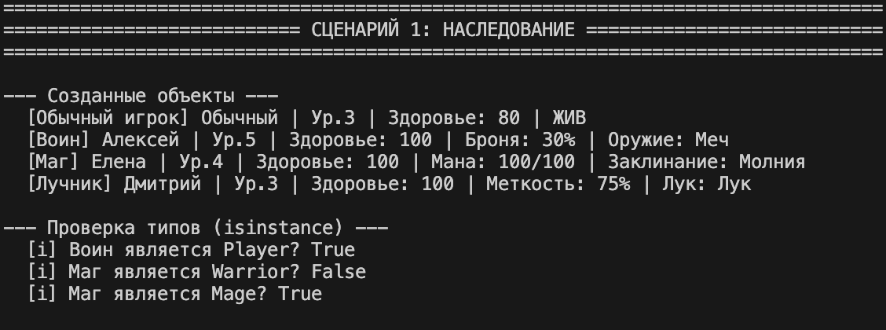
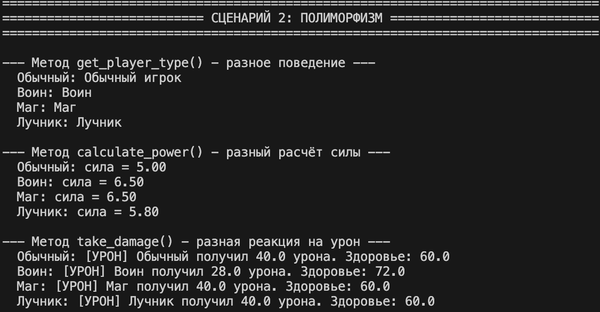
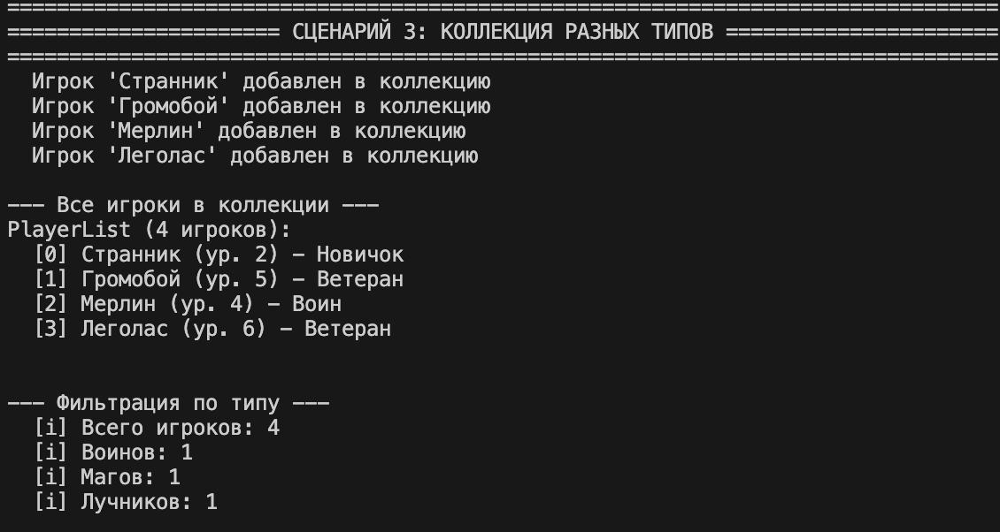
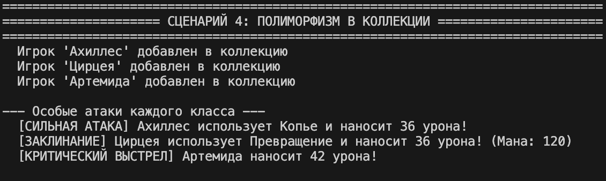
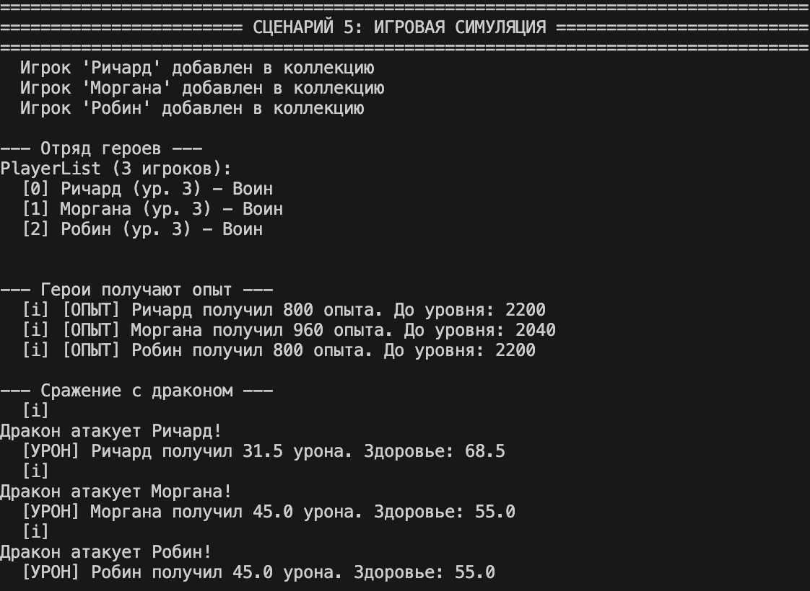

# ЛР-3 — Наследование и иерархия классов

## Цель работы

Освоить механизм наследования классов, научиться строить иерархию объектов, понять разницу между базовым и производными классами, освоить переопределение методов и полиморфизм.

---

## Предметная область

**Игровая логика / RPG**

Базовая сущность: **`Player`** (Игрок) → иерархия специализированных классов


## Реализованная иерархия классов
```text
Player (базовый класс из ЛР-1)
├── Warrior (Воин)
├── Mage (Маг)
└── Archer (Лучник)
```

### Базовый класс `Player`

Содержит общие атрибуты и методы для всех игроков:
- имя, уровень, здоровье, опыт
- методы: `take_damage()`, `heal()`, `add_experience()`, `revive()`
- полиморфные методы: `get_player_type()`, `calculate_power()`

### Производный класс `Warrior` (Воин)

| Новые атрибуты | Значение |
|----------------|----------|
| `armor` | Броня (уменьшает получаемый урон в %) |
| `weapon` | Тип оружия |

| Новые методы | Описание |
|--------------|----------|
| `power_attack()` | Сильная атака воина |

**Особенности:**
- Переопределён метод `take_damage()` — урон уменьшается на процент брони

### Производный класс `Mage` (Маг)

| Новые атрибуты | Значение |
|----------------|----------|
| `mana` | Магическая энергия (0-100) |
| `spell` | Основное заклинание |

| Новые методы | Описание |
|--------------|----------|
| `cast_spell()` | Колдовство, тратит ману |
| `restore_mana()` | Восстановление маны |

**Особенности:**
- Переопределён метод `add_experience()` — маг получает на 20% больше опыта

### Производный класс `Archer` (Лучник)

| Новые атрибуты | Значение |
|----------------|----------|
| `accuracy` | Меткость (шанс крит. удара в %) |
| `bow_type` | Тип лука |

| Новые методы | Описание |
|--------------|----------|
| `critical_shot()` | Критический выстрел (зависит от меткости) |

---

## Полиморфные методы

| Метод | Базовый класс | Warrior | Mage | Archer |
|-------|---------------|---------|------|--------|
| `get_player_type()` | "Обычный игрок" | "Воин" | "Маг" | "Лучник" |
| `take_damage()` | Обычный урон | Урон с учётом брони | Обычный урон | Обычный урон |
| `add_experience()` | Обычный опыт | Обычный опыт | +20% опыта | Обычный опыт |

---

## Демонстрация работы

### Сценарий 1: Основы наследования

- Создание объектов всех типов (Player, Warrior, Mage, Archer)
- Демонстрация новых атрибутов (броня, мана, меткость)
- Проверка типов через `isinstance()`



### Сценарий 2: Полиморфизм

- Вызов `get_player_type()` — разные результаты для разных типов
- Вызов `take_damage()` — воин получает меньше урона
- Вызов `add_experience()` — маг получает бонус к опыту



### Сценарий 3: Коллекция разных типов

- Хранение объектов всех типов в одной коллекции `PlayerList`
- Фильтрация по типу через `get_warriors()`, `get_mages()`, `get_archers()`



### Сценарий 4: Полиморфизм в коллекции

- Вызов особых атак для каждого типа (`power_attack()`, `cast_spell()`, `critical_shot()`)



### Сценарий 5: Игровая симуляция

- Создание отряда из разных героев
- Получение опыта и повышение уровня
- Симуляция сражения с драконом




## Структура проекта

```text
python_labs/
├── src/
│   ├── lab01/
│   │   ├── model.py       # Базовый класс Player (не изменялся)
│   │   └── validate.py    # Функции валидации
│   ├── lab02/
│   │   └── collection.py  # Класс PlayerList (добавлены методы фильтрации)
│   └── lab03/
│       ├── base.py        # Копия Player с полиморфными методами
│       ├── models.py      # Производные классы Warrior, Mage, Archer
│       ├── demo.py        # Демонстрация работы
│       └── README.md      # Отчёт
└── images/
    └── lab03/             # Скриншоты выполнения
```
## Заключение

### В ходе лабораторной работы были изучены и реализованы:
### Наследование (оценка 3)

- Создано 3 дочерних класса от базового Player

- Добавлены новые атрибуты (armor, mana, accuracy)

- Добавлены новые методы (power_attack(), cast_spell(), critical_shot())

- Использован super() для вызова конструктора базового класса

- Код базового класса не дублируется

### Полиморфизм (оценка 4)

- Переопределены методы: take_damage(), add_experience(), __str__()

- Использован isinstance() для проверки типов

- Один интерфейс — разная реализация

### Интеграция с коллекцией (оценка 5)

- Коллекция хранит объекты всех типов

- Добавлена фильтрация по типу

- Полиморфные методы работают внутри коллекции

